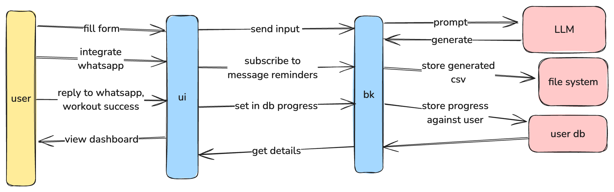

# Genfit

Genfit is an AI-powered fitness platform that generates personalized workout plans, manages user profiles, and provides comprehensive workout history dashboarding. The platform combines modern web technologies with artificial intelligence to deliver tailored fitness solutions.

## Features

- **AI-Powered Workout Plans**: Generates personalized workout routines based on user's fitness level, goals, and available equipment
- **User Profile Management**: Comprehensive user profile system tracking fitness metrics and progress
- **Interactive Form Wizard**: Multi-step form collection for detailed user information
- **Progress Tracking**: Visual dashboards for monitoring workout history and achievements
- **Equipment-Aware Planning**: Customizes workouts based on available gym equipment

## Tech Stack

### Frontend
- React.js with Vite
- React Hook Form for form management
- Modern UI/UX with responsive design
- Custom styled components

### Backend
- Go (Golang)
- RESTful API architecture
- AI integration for workout plan generation

## Getting Started

### Prerequisites
- Node.js (v16 or higher)
- Go (v1.20 or higher)
- Git

### Frontend Setup
1. Navigate to the UI directory:
   ```bash
   cd ui
   ```
2. Install dependencies:
   ```bash
   npm install
   ```
3. Start the development server:
   ```bash
   npm run dev
   ```
   The application will be available at http://localhost:3000

### Backend Setup
1. Navigate to the backend directory:
   ```bash
   cd genfit-backend
   ```
2. Install Go dependencies:
   ```bash
   go mod download
   ```
3. Start the server:
   ```bash
   go run main.go
   ```
   
Design:
